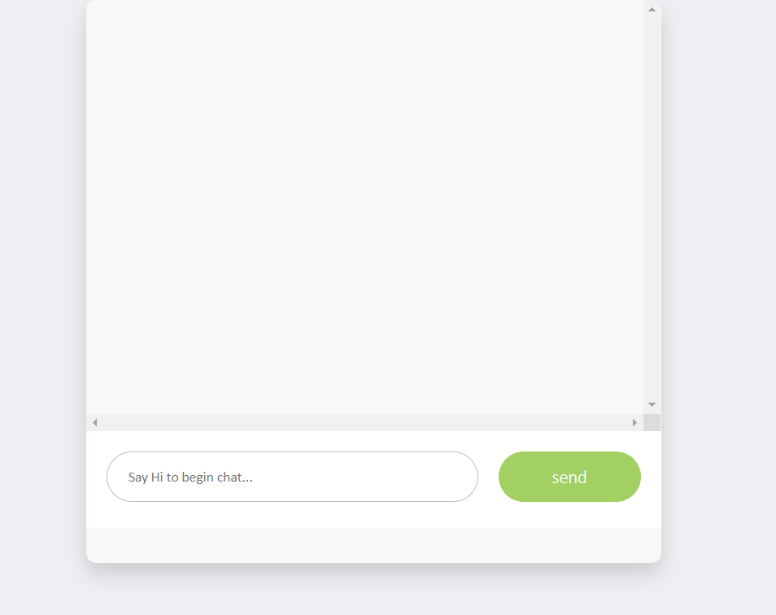

# Basic Chatbot using RASA 

## Business scenario 

Chatbot solution was now start adopt by business & organization to handle their user request and inquiry. In the example below, we try to develop a simple chatbot to handle service inquiry and complaint 




## Setup 

#### Install Rasa NLU

`$pip install rasa_nlu`

#### Install Rasa Core

```

$git clone https://github.com/RasaHQ/rasa_core.git
$cd rasa_core
$pip install -r requirements.txt
$pip install -e .
```


## Step 1 - Collect conversation data 

sample data was located at data/data.json


## Step 2 - Train NLU model

```
python -m rasa_nlu.train -c config_spacy.json --data data/data.json -o models/nlu
```


## Step 3 - Initiate NLU server 

```
python -m rasa_nlu.server -c config_spacy.json --path ./models/nlu
```

## Step 4 - Run web chatbot UI 

```
python bot-application2/app.py
```


## Step 5 - Start chatting!


## Further Improvements:

to-be-updated
